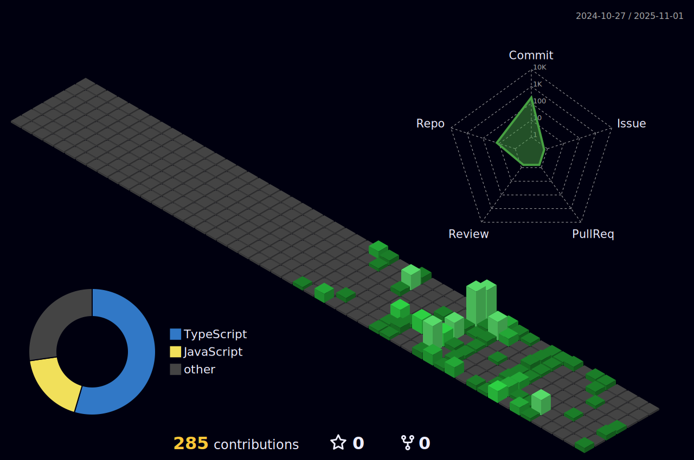

    

<h1 align="center" style="margin:2px; padding: 5px; overflow:True">

</h1>
<h2 align="center">
    A passionate software developer from India
     
</h2>

    
🔭 I’m currently working on <b>A Marketplace Application</b>

    
🌱 I’m currently learning <b>Docker, K8, Three JS, AWS</b>

    
🚀 Building scalable web apps using <b>PERN and MERN Stack</b> 

    
🐍 Experienced with Python scripting & Data Automation  

 
 

 
  
  &nbsp;
  &nbsp;
  &nbsp;
  
    &nbsp;
  &nbsp;
  &nbsp;
  
    &nbsp;
  &nbsp;
  &nbsp;

    &nbsp;
  &nbsp;
  &nbsp;

 
 
<h2 align="center"> 📝 Featured Projects 📝</h2>

<table align="center">
  <tr>
    <td align="center" width="250" height="300">
      <h2>👚 Vastrum </h2>
      
One stop solution changing trendy Fashion. A full stack e-commerce platform targeting Fashion Industry.

      
<strong>Tech Stack:</strong> React • Postgre • JavaScript • Node

      
<strong>Status:</strong> 🚧 In Progress

      <a href="https://github.com/Ritik-Nagpure/Vastrum" target="_blank">🔗 View Repository</a>
    </td>
    <td align="center" width="250">
      <h2>🤖 Arya</h2>
      
An AI tool with multiple usage like chat, analyze and keep track on tasks behind the back.

      
<strong>Tech Stack:</strong> React • Postgre • JavaScript • Node

      
<strong>Status:</strong> 🚧 In Progress

      <a href="https://github.com/Ritik-Nagpure/Arya" target="_blank">🔗 View Repository</a>
    </td>
    <td align="center" width="250">
      <h2>🛠️ Sarvum</h2>
      
Complete solution to everyday tasks. A handy tool to update and analyze every aspect of task.

      
<strong>Tech Stack:</strong> React • Postgre • JavaScript • Node

      
<strong>Status:</strong> 🚧 In Progress

      <a href="https://github.com/Ritik-Nagpure/Sarvum" target="_blank">🔗 View Repository</a>
    </td>
  </tr>
</table>

 

  <h2>🐍 My Contributions 🐍</h2>
   
  
  
  
    

<h2 align="center">⚡ Stats ⚡</h2>
 

 
    
 
 
  
 
 
  

 
 
 

<h2 align="center">⚒️ Languages-Frameworks-Tools ⚒️</h2>
 

    
    

 
 

<h3 align="center" style="color:#bb05f2ff; font-size:24px;">
    Thanks for visiting my profile!  
</h3>

 
 

